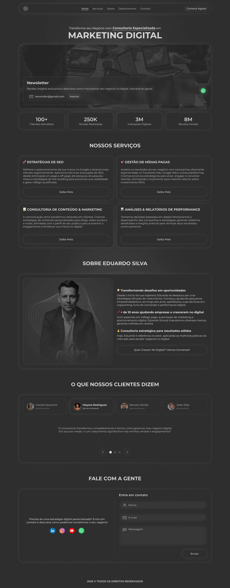

# Eduardo Marketing Digital

## Sobre o Projeto

Eduardo Marketing Digital é uma plataforma moderna desenvolvida do zero para a criação e gestão dinâmica de páginas web focadas em marketing digital. Todo o design da interface foi pensado e criado no Figma, garantindo uma experiência visual única e alinhada às melhores práticas de UX/UI.

O conteúdo do site é facilmente gerenciado via **DatoCMS**, permitindo controle total sobre as seções, ordenação dinâmica e atualizações em tempo real que disparam deploys automáticos.

### Funcionalidades principais

- Interface 100% responsiva e personalizada, criada no Figma e implementada em React com Styled Components.
- Conteúdo dinâmico gerenciado via DatoCMS, com integração contínua (CI/CD) que realiza deploy automático a cada atualização.
- SEO dinâmico configurável, incluindo robots.txt e sitemap.xml.
- Estrutura flexível da página com controle total sobre posição e visibilidade das seções via CMS.
- Futuro suporte a testes end-to-end com Cypress e Skeleton para otimizar a experiência do usuário durante carregamentos.
- Notificações amigáveis via React Toastify.
- Navegação suave e estilizada com React Scroll.
- Experiências animadas e interativas com Motion.
- Carrossel de imagens eficiente com Swiper.

---

## Tecnologias Utilizadas

### Front-End

- **Next.js 15.2.1** – Framework React para renderização híbrida (SSG, SSR e CSR).
- **React 19.0.0** – Biblioteca para criação da interface.
- **Styled Components 6.1.15** – Estilização modular e dinâmica baseada em CSS-in-JS.
- **TypeScript 5** – Tipagem estática para segurança e produtividade.
- **React Scroll** – Navegação suave entre seções.
- **React Toastify** – Feedback visual para notificações.
- **Motion** – Animações fluidas e modernas.
- **Swiper** – Componentes para carrosséis e sliders responsivos.
- **Lodash** – Utilitários funcionais.

### Dev Tools e Qualidade

- **ESLint 9** e **eslint-config-next** – Análise estática para manter padrão e qualidade do código.
- **Cypress 14.1.0** e **@testing-library/cypress** – Testes end-to-end automatizados (em desenvolvimento).
- **TypeScript** para garantir a tipagem.
- **SVGR Webpack** – Importação e uso de SVGs como componentes React.
- **Wait-on** – Espera de recursos para pipelines de build e deploy.
- **Vercel CLI** – Deploy contínuo e preview automático via integração com Vercel.

---

## Scripts Úteis

| Script           | Descrição                                     |
|------------------|-----------------------------------------------|
| `dev`            | Inicia ambiente de desenvolvimento Next.js    |
| `build`          | Cria build otimizado para produção            |
| `lint`           | Executa análise estática do código            |
| `lint:fix`       | Aplica correções automáticas no código        |
| `type-check`     | Checa tipos TypeScript sem gerar arquivos     |
| `cy:open`        | Abre interface Cypress para testes e2e        |
| `cy:run`         | Executa testes Cypress no modo headless       |
| `deploy:staging` | Builda e realiza deploy automático no staging |
| `deploy:prod`    | Deploy para produção via pipeline CI/CD       |
| `deploy:preview` | Gera preview automático para Pull Requests    |

---

## Integração com DatoCMS

- O conteúdo é alimentado diretamente via DatoCMS, permitindo editar textos, imagens e reorganizar seções.
- A cada alteração no CMS, um webhook dispara o deploy automático no Vercel, garantindo que o site esteja sempre atualizado.
- Possibilita flexibilidade e autonomia para equipes não técnicas gerenciarem o site sem depender de deploy manual.

---

## Próximos passos

- Implementação de testes e2e completos usando Cypress para garantir qualidade contínua.
- Uso de Skeleton Loading para melhorar experiência durante carregamentos lentos.
- Monitoramento e otimização contínua de SEO e performance.
- Eventuais integrações com outras ferramentas de marketing digital.

---

## Links úteis

- [Site em produção](https://eduardo-marketing-digital.vercel.app/)

---

## Preview

